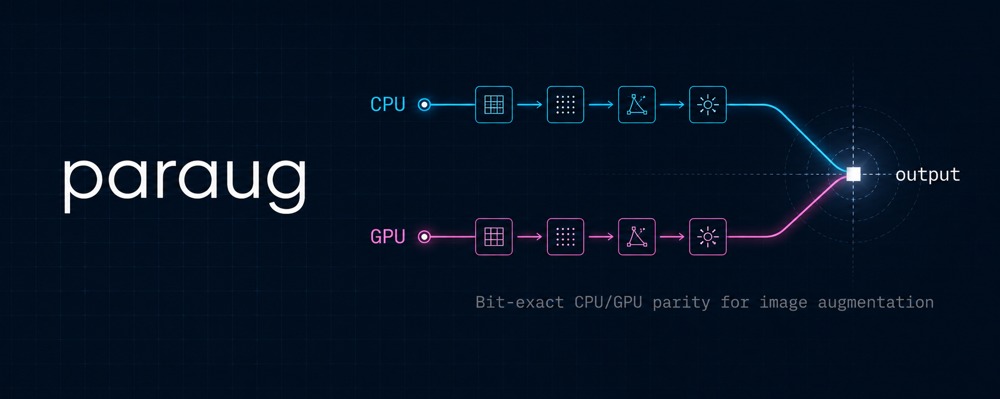

# paraug



> **影像增強的 CPU/GPU 位元級精確對齊（bit-exact parity）。**

[](LICENSE)
[]()

**Languages**: [English](README.md) | 繁體中文

`paraug` 是一個 PyTorch 原生的影像增強函式庫，保證**相同的 seed 在 CPU 與
CUDA 上產生相同的輸出**。每個 primitive 的隨機數都在 CPU 端取樣，不受
tensor 在哪個 device 影響 —— 即使訓練流程在 CPU/GPU 階段間隨機切換、或
unit test 換 backend 跑，結果仍然 deterministic。

## 為什麼需要 parity

大多數的增強函式庫（albumentations、kornia、torchvision）使用 device-local
RNG。同 seed、CPU/CUDA 結果不同。這在三個場景會踩雷：

1. **可重現性**：論文跟 code 的對應斷裂 —— reviewer 跑不出你 published 的數字。
2. **除錯**：CPU 端的 unit test 抓不到 GPU-only bug，反之亦然。
3. **分散式訓練**：不同硬體的 worker 會 drift 開來。

paraug 的解法是把 RNG 隔離到 CPU（`torch.Generator(device="cpu")`），只把
deterministic 的 torch 運算 route 到 device。容差：

- **Elementwise 運算**（gamma、noise、color jitter…）：atol 1e-6
- **`grid_sample` 類運算**（affine、perspective、tps…）：atol 2e-4
  （ATen 與 cuDNN bilinear 的 ulp drift）

## 安裝

```bash
pip install paraug
```

或從原始碼安裝：

```bash
pip install git+https://github.com/alieuidsh/paraug.git
```

## 快速上手

```python
import torch
from paraug import AugPipeline

aug = AugPipeline({
    "geometric": {
        "affine": {"p": 1.0, "rot_deg": 15.0, "scale_range": (0.9, 1.1)},
        "tps":    {"p": 0.5, "max_disp": 12.0, "n_ctrl": 5},
    },
    "photometric": {
        "gamma":         {"p": 0.5},
        "color_jitter":  {"p": 0.5},
        "gaussian_blur": {"p": 0.3},
    },
})

img  = torch.rand(2, 3, 256, 256)         # (B, C, H, W)
mask = torch.ones(2, 1, 256, 256)         # optional

img_out, mask_out = aug(img, mask=mask, seed_base=42, epoch=0, step=0)
```

同樣的 call 跑在 GPU 上，輸出在容差內位元級對齊：

```python
img_gpu  = img.cuda()
mask_gpu = mask.cuda()
img_cuda, mask_cuda = aug(img_gpu, mask=mask_gpu, seed_base=42, epoch=0, step=0)
assert (img_out - img_cuda.cpu()).abs().max() < 2e-4
```

## 把 GT 當 image 額外 channel 一起 warp

`n_image_channels=N` 宣告：前 N 個 channel 視為「image」（geometric +
photometric 都套），其餘 channel 只走 geometric warp。Photometric primitive
會 skip 額外 channel，所以堆疊在 image 上的 ground-truth field 數值不會被
gamma / noise / shadow 動到，卻又共用同一張 back-warp grid：

```python
import torch
from paraug import AugPipeline

# (B, 3, H, W) RGB + (B, 2, H, W) 整張影像 heatmap GT = 5 channel
img_rgb  = torch.rand(2, 3, 256, 256)
gt_h     = render_h_line_heatmap(...)   # 自己的 renderer; (B, 1, H, W)
gt_v     = render_v_line_heatmap(...)   # (B, 1, H, W)
img_5ch  = torch.cat([img_rgb, gt_h, gt_v], dim=1)   # (B, 5, H, W)

aug = AugPipeline({
    "geometric":   {"affine": {"p": 1.0, "rot_deg": 10.0},
                      "tps":    {"p": 0.5, "max_disp": 8.0, "n_ctrl": 5}},
    "photometric": {"gamma": {"p": 0.5, "gamma_range": (0.8, 1.2)}},
}, n_image_channels=3)

out, _ = aug(img_5ch, seed_base=42)
# out[:, :3] = warp + gamma 後的 RGB
# out[:, 3:] = 只 warp 沒 gamma 的 heatmap
```

GT 是 2-D field 的任務（line heatmap、連續標籤分割、distance transform、
切線場）原本要解 forward-warp 才能跟著 image 對齊，現在直接把 GT 當 channel
堆上去 + 同一次 `grid_sample`，省下整套 forward-warp solver。預設
`n_image_channels=None` 保留原本行為，沒設就不切。

`random_shadow` 雖然 dispatch 屬 geometric，但效果是乘法的 photometric，
split 啟動時會被當 photometric 處理（不會把陰影因子套在 GT channel 上）。

## Primitive 列表

### Geometric（7 個）

| 名稱 | 說明 |
|---|---|
| `affine` | 透過 `F.affine_grid` 做旋轉 + 縮放 + 平移 |
| `perspective` | 四角點 jitter 解出 homography |
| `random_crop_pad` | 縮放後 pad 回原尺寸 |
| `elastic_transform` | 低解析度隨機 displacement field bilinear 上取樣 |
| `optical_distortion` | 徑向 barrel / pincushion 失真（k·r²）|
| `random_shadow` | 軟邊三角形乘法陰影 |
| `tps` | 低解析度控制網格的 thin-plate-spline 類 warp |

### Photometric（24 個）

亮度 / 顏色：`gamma`、`color_jitter`、`hue_shift`、`random_grayscale`、
`lighting`、`clahe`、`local_contrast`、`sharpness`。

雜訊：`gaussian_noise`、`salt_pepper_noise`、`salt_patches`。

模糊 / 壓縮：`gaussian_blur`、`motion_blur`、`jpeg_approx`。

光線：`vignette`、`specular_highlight`、`specular_streaks`。

內容疊加：`cutout`、`paper_texture_overlay`、`watermark`、
`random_text_overlay`、`background_compose`、`stains`、`creases`。

## Parity 對比

| 函式庫 | Bit-exact CPU↔GPU | Per-item RNG | GPU 原生 | Mask-aware | Batch-native | # Geometric¹ | # Photometric¹ | License |
|---|---|---|---|---|---|---|---|---|
| **paraug** | **✓**（1e-6 / 2e-4）² | ✓ | ✓ (torch) | ✓ | ✓ | 7 | 24 | Apache 2.0 |
| albumentations | ✗（numpy-only）| ✓ | ✗ | ✓ | 部分 | ~20 | ~50+ | MIT |
| kornia | ✗（device-local RNG）| ✓ | ✓ (torch) | ✓ | ✓ | ~10 | ~45 | Apache 2.0 |
| torchvision.v2 | ✗（device-local RNG）| ✓ | ✓ (torch) | 部分 | ✓ | ~18 | ~12 | BSD-3 |
| imgaug | ✗（numpy-only）| ✓ | ✗ | ✓ | 部分 | ~20 | ~40 | MIT |
| augly | ✗（PIL-only）| ✓ | ✗ | ✗ | ✗ | ~5 | ~20 | MIT |

<sub>¹ 其他函式庫的計數為 2026-05 sample 自各 project 的 `__init__.py` /
docs index，數字會隨版本變動 —— 請以各 project 的官方 API 為準。paraug
的計數來自 code（`len(GEOMETRIC_PRIMITIVES)` / `len(PHOTOMETRIC_PRIMITIVES)`），
精確值。</sub>

<sub>² 容差由 `tests/test_parity.py` 在 NVIDIA 5060 Ti + 4080 上於 v0.1.0
驗證：1e-6 適用於 `PHOTO_ELEMENTWISE` 列出的 6 個純 elementwise photometric
運算（gamma / gaussian_noise / color_jitter / vignette / cutout /
hue_shift），2e-4 適用於 grid_sample 類（geometric）跟 conv 類（blur）運算。
**GitHub 免費 CI runner 沒 GPU**，所以 13 個 CUDA parity test 在 CI 上 skip
—— 歡迎社群在其他 GPU SKU 上驗證後開 PR 補上結果，或本機跑 `pytest
tests/test_parity.py -k cpu_vs_cuda` 把輸出貼上來。</sub>

### 適合用 paraug 的場景

- 跨 device 的可重現性（paper-grade ablation 不能讓 CPU↔GPU 漂移破壞 baseline）
- 異質硬體的分散式訓練
- 對 unit test 友善的增強流程（CPU-side RNG → 免費 CI runner 就能重現開發者 GPU 上的結果）

### **不**適合用 paraug 的場景

- 你需要 50+ 種 primitive 開箱即用 → 試 `albumentations` 或 `imgaug`
- 你需要 PIL 風格的 image-by-image API → 試 `augly`
- 你需要內建的組合 op 像 `OneOf` / `SomeOf` → 試 `albumentations`

## 範例

見 `examples/`：

- `01_quickstart.py` — 最小的 load → augment → save 流程
- `02_mask_aware.py` — image + segmentation mask 一起 warp
- `03_cpu_gpu_parity.py` — 同 seed 跑 CPU 與 CUDA，assert
  `max_abs_diff < 2e-4`

## 引用

```bibtex
@software{paraug2026,
  author = {alieuidsh},
  title  = {paraug: Bit-exact CPU/GPU parity for image augmentation},
  year   = {2026},
  url    = {https://github.com/alieuidsh/paraug},
}
```

## License

Apache 2.0 —— 詳見 [LICENSE](LICENSE)。
